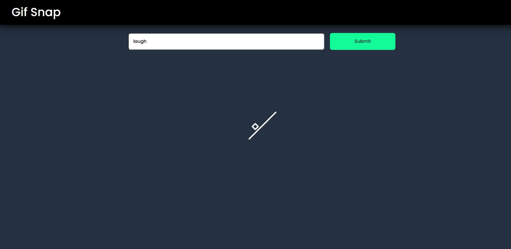
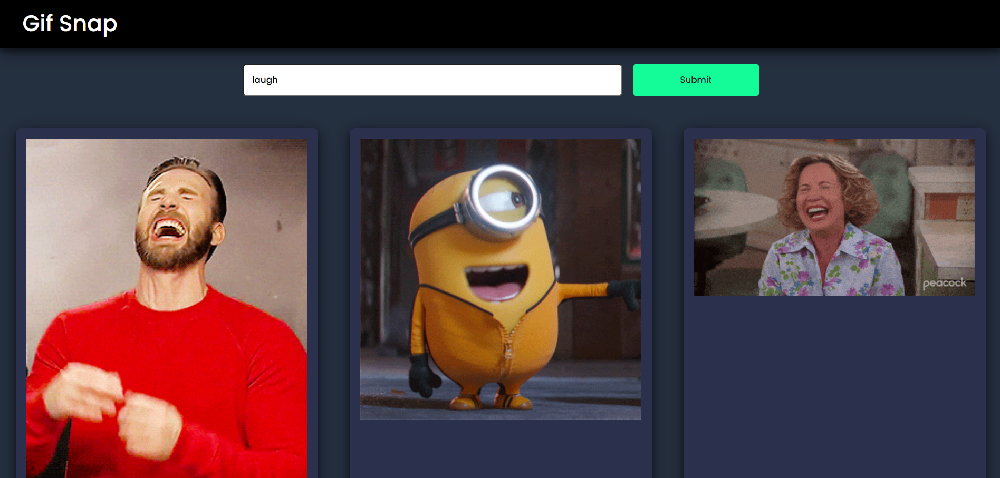

# GIF Snap



Welcome to **GIF Snap**! GIF Snap is a fun and interactive app that allows users to search for, capture, and share animated GIFs. Built using HTML, CSS, and JavaScript, this app provides a seamless experience for creating and sharing GIFs in real-time.

## Table of Contents

- [Features](#features)
- [Technologies Used](#technologies-used)
- [Demo](#demo)
- [Installation](#installation)
- [Usage](#usage)
- [How to Use](#how-to-use)
- [Contributing](#contributing)

## Features

- Search for trending and specific GIFs via GIPHY API
- Capture live webcam footage to create custom GIFs
- Download and share GIFs on social media
- Clean, easy-to-use interface
- Mobile-friendly, responsive design

## Technologies Used

- **HTML5**
- **CSS3**
- **JavaScript**
- **GIPHY API**

## Demo

Check out the live demo of **GIF Snap** [here](https://gif-snap.netlify.app/).

## Installation

To run GIF Snap locally, follow these steps:

1. **Clone the repository:**

    ```sh
    git clone https://github.com/omgupta7352/gif-snap.git
    ```

2. **Navigate to the project directory:**

    ```sh
    cd gif-snap
    ```

3. **Open the index.html file in your browser:**

    ```sh
    open index.html
    ```

## Usage

Once you have the app running in your browser, you can start searching for and creating GIFs right away! The following are the main features:

- **Search GIFs:** Use the search bar to find GIFs by keywords or explore trending GIFs.
- **Capture a GIF:** Use your webcam to record a short video and convert it into a GIF.
- **Download and Share:** After creating or selecting a GIF, download it or share it directly on social media.

## How to Use

1. **Searching for GIFs:**
   - Enter a keyword in the search bar to browse GIFs related to your search.
   - View trending GIFs by clicking on the "Trending" button.
3. **Sharing GIFs:**
   - Once you've selected or created a GIF, click the "Download" button to save it locally.
   - Use the "Share" button to share the GIF on your favorite social media platform directly.

## Contributing

We welcome contributions to improve GIF Snap! If you want to contribute, follow these steps:

1. **Fork the repository**
2. **Create a new branch:** `git checkout -b feature/your-feature-name`
3. **Commit your changes:** `git commit -m 'Add some feature'`
4. **Push to the branch:** `git push origin feature/your-feature-name`
5. **Open a pull request`

---

Thanks for checking out GIF Snap! Have fun creating and sharing your own GIFs.
